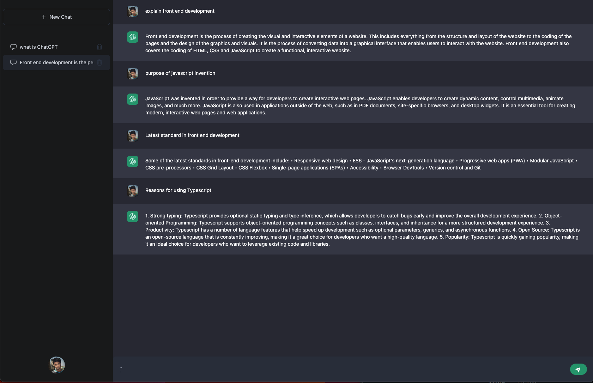

# Chat-bot Messenger Project

> The chat messenger app allows users to communicate with OpennAI chatGPT model in real-time through a simple and intuitive interface. The OpenAI API provides resposes to the user queries. The webapp has login functionaliy with NextAuth and saves the users chat in Firestore Database

## ⚒️  Built with

- Html
- Css
- JavaScript
- TypeScript

## 🎞️ Frameworks and Technologies used

- Tailwind
- Firebase
- React
- NextJS

## 🖥️ Live Demo
- [Demo](https://chatbot-messenger-ukesh.vercel.app/) :point_left:

## 🤝 Contributing

Contributions, issues, and feature requests are welcome!

Feel free to check the [issues page](../../issues/).

## Show your support

Give a ⭐️ if you like this project!

## Acknowledgments

- [OpenAI](https://openai.com/api/) for the external API used in the project

